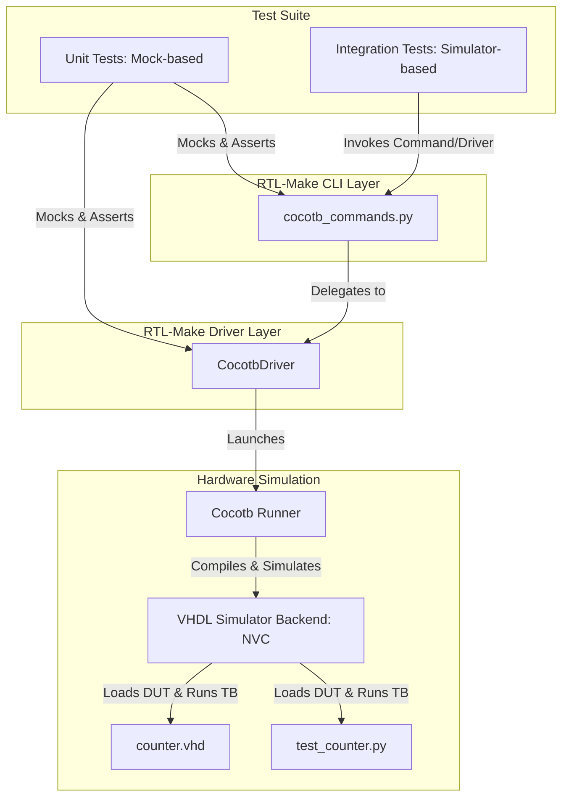
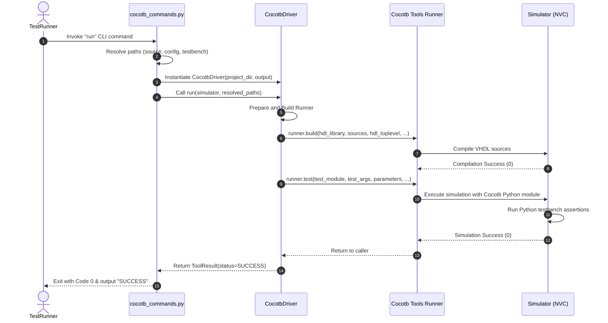

# Technical Design Document: Cocotb Test Verification Redesign

**Author:** Antigravity (AI Coding Assistant)  
**Date:** July 28, 2026  
**Status:** Under Review

---

## 1. Architecture Overview

This design document outlines the technical plan for updating the `tests/test_cocotb` suite. The goal is to fully verify both the command-line interface (CLI) commands (implemented in `src/rtl_make/commands/cocotb_commands.py`) and the driver business logic (implemented in `src/rtl_make/drivers/cocotb/driver.py`) using the `vhdl_test_project` test fixture.

### Component Relationship

The test suite interacts with three layers of the application:
1. **CLI Layer (`cocotb_commands.py`)**: Handles CLI arguments, paths resolution, and output handling.
2. **Driver Layer (`driver.py`)**: Prepares environment variables, generics/parameters, builds the VHDL code using Cocotb runners, and executes the simulation.
3. **HDL / Testbench Fixtures (`vhdl_test_project/`)**: The actual hardware description code (`counter.vhd`) and test framework code (`test_counter.py`) run inside the simulator.

The following architecture diagram represents how the testing framework verifies these layers:



---

## 2. Data Model

The data models for testing verify the correctness of the configurations passed to and from the commands and driver.

### 2.1 Configuration Schemas (`src/rtl_make/schemas/sim.py`)
- **`DutConfig`**: Handles top-level parameters/generics (like `BUG_ADDER` and `CRASH_SIM`) and environment variables (`extra_env`).
- **`SimRunnerConfig`**: Handles build arguments, simulation arguments, waves, and simulator-specific options.
- **`RegressionConfig`**: Handles multiple regression runs, mapping each run to specific testbenches and configurations.

### 2.2 Test Results Model
Cocotb writes test results to an XML file (`results.xml`) in JUnit format. The driver will parse or rely on Cocotb's execution code, which we must verify:
- **Success case**: `<testsuite failures="0" ...>`
- **Assertion failure**: `<testcase ...><failure message="..." type="failure">...</failure></testcase>`
- **Simulator crash**: Missing `results.xml` or empty/unparseable XML with non-zero simulator exit code.

---

## 3. API Design

The CLI options for the `cocotb` group command are validated through the test runner:

### 3.1 CLI Endpoints Under Test
- **`rtl-make cocotb run`**:
  - Arguments: `--tb`, `--src`, `--sim`, `--dcfg`, `--rcfg`, `--tcfg`
- **`rtl-make cocotb build`**:
  - Arguments: `--src`, `--sim`, `--dcfg`, `--rcfg`
- **`rtl-make cocotb regression`**:
  - Arguments: `--src`, `--sim`, `--cfg`

### 3.2 Test Verification Scenarios
Each command and driver capability must be verified against specific scenarios:

| Scenario ID | Name | DUT Configuration | Expected Outcome | Verification Point |
|---|---|---|---|---|
| **SC-01** | Happy Path Run | Default | Simulation succeeds | CLI exits 0, Log files created, output displays PASS |
| **SC-02** | Failed Assertion | `BUG_ADDER = true` | Simulation fails | CLI exits with failure, output displays FAIL |
| **SC-03** | Simulator Crash | `CRASH_SIM = true` | Simulator aborted | CLI catches non-zero exit/crash, output displays error |
| **SC-04** | Build Only | Default | Build succeeds | Compiles files without running test, exits 0 |
| **SC-05** | Broken VHDL Build | Invalid VHDL file | Build fails | Compilation throws error, driver reports build failure |
| **SC-06** | Multi-Config Regression | Regression JSON config | Iterates runs | Executes multiple configurations, summarizes counts |

---

## 4. Technology Choices

1. **Pytest**: Chosen as the main test runner for its robust parameterization and fixture support.
2. **Typer Testing (`CliRunner`)**: Part of the Typer library, allows isolated testing of CLI commands with input variables, captured output, and exit status.
3. **Mocks (`unittest.mock`)**: Used to isolate CLI tests and driver unit tests from external system packages and compiled simulation binaries when run in standard CI environments.
4. **VHDL Simulator (NVC)**: The single required simulator backend for `vhdl_test_project`.

---

## 5. Sequence & Flow Diagrams

### 5.1 Compilation & Test Execution Flow (Successful Run)



---

## 6. Trade-offs and Alternatives Considered

### 6.1 Core Testing Strategy Alternatives

```carousel
=== Alternative A: Pure Mocking (Unit Tests) ===
**Description:** Mock all runner processes, subprocess calls, and filesystem generation.
* **Pros:**
  - Extremely fast execution (<1s).
  - Guarantees tests pass in any environment without installing NVC or cocotb libraries.
* **Cons:**
  - Cannot detect actual integration bugs (e.g. invalid simulator command arguments, results.xml schema changes, or runner.build API drift).
<!-- slide -->
=== Alternative B: Pure Integration Tests ===
**Description:** Run all tests using NVC against `vhdl_test_project`.
* **Pros:**
  - High fidelity. Validates that the runner works with the real simulation engine.
* **Cons:**
  - Heavy and slow.
  - Hard dependency on having VHDL compiler (`nvc`) installed. Tests fail immediately if run on a machine without it.
<!-- slide -->
=== Alternative C (Recommended): Hybrid / Conditional Testing ===
**Description:** Combine mock-based unit tests for all CLI option variations and driver methods, and add simulator-based integration tests that are dynamically skipped if `nvc` is not found.
* **Pros:**
  - Safe for all development environments (defaults to skip integration if compiler is missing).
  - Verifies both unit isolation and real system-level integration.
* **Cons:**
  - Slightly more test code complexity to maintain (managing mocks + real runs).
```

### 6.2 CI Environment Skips (Skip Logic Explained)

"CI environment skips" refers to dynamically skipping integration tests when the VHDL simulator `nvc` is not present in the current operating system environment. 

#### Why is this necessary?
1. **Developer Environment Diversity**: Different developers or machines (e.g. standard macOS/Linux local laptops, standard virtual machines) might not have the compiled binaries of the `nvc` simulator installed.
2. **CI Pipeline Constraints**: Continuous Integration (CI) runners might execute tests on bare-metal containers without hardware EDA tools pre-installed.
3. **Preventing False Positives**: If the tests ran unconditionally, any environment lacking `nvc` would show failed tests. By checking if `nvc` is present on the `PATH` using `shutil.which("nvc")`, we can dynamically skip simulator-dependent test cases with a clear skip message (`pytest.mark.skipif`), while keeping other unit/mock tests active.

### 6.3 Selection Criteria & Comparison Matrix

| Criteria | Alternative A (Mocks) | Alternative B (Integration) | Alternative C (Hybrid - Recommended) |
|---|---|---|---|
| **Speed** | 🟢 Fast | 🔴 Slow | 🟡 Medium |
| **Local Portability** | 🟢 High (No dependencies) | 🔴 Low (Requires compiler) | 🟢 High (Auto-skips) |
| **Bug Detection Fidelity**| 🔴 Low | 🟢 High | 🟢 High |
| **Maintainability** | 🟡 Medium (Mocks can drift) | 🟢 High | 🟡 Medium |

**Final Decision:** **Alternative C (Hybrid)** is chosen. We will use mocks to ensure CLI and basic driver validations are tested deterministically, and dynamically run real simulator integration tests on `vhdl_test_project` if the `nvc` compiler is present on the path.

---

## 7. Security and Performance Considerations

- **Environment Pollution**: Cocotb relies on environment variables (`PYTHONPATH`, `SIM`, `MODULE`, `TOPLEVEL`). The test suite must isolate environment changes (e.g. using pytest's `monkeypatch` fixture) so that tests running concurrently do not interfere with each other.
- **Log File Cleanup**: Test runs create build directories (e.g. `nvc_build/`) and run directories. We will use pytest's `tmp_path` fixture to compile and run in sandbox directories, keeping the repository root clean.
- **Process Timeouts**: Simulation crashes might result in infinite loops or hangs. The test wrapper/driver should implement timeouts for subprocess executions to avoid blocking test runners or CI pipelines.

---

## 8. Rollout & Migration Plan

1. **Fix HDL Fixtures**: Correct `counter.vhd` and `counter_broken.vhd` to contain valid VHDL code and invalid VHDL code respectively, instead of duplicate Python tests.
2. **Implement Mock-Based CLI Tests**: Create tests in `tests/test_cocotb/test_cocotb_cli.py` to verify command invocation, configurations loading, and path resolutions.
3. **Implement/Enhance Driver Integration Tests**:
   - Update `tests/test_cocotb/test_cocotb.py` to use hybrid checks.
   - Use pytest's parameterization to test all three test states (Success, Fail, Crash).
   - Use conditional skipping (`pytest.mark.skipif`) based on simulator availability (`check_simulator_backend("nvc")`).
4. **Validation run**: Execute `pytest tests/test_cocotb` under a controlled python environment to confirm test suite health.
