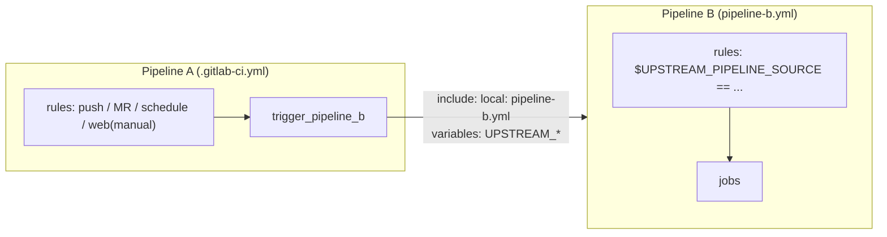

# Pipeline A → Pipeline B (parent/child) architecture

Two pipelines defined in the same repo. Pipeline **A** runs first and conditionally triggers pipeline **B** as a child pipeline, forwarding the context B needs to re-evaluate the same trigger conditions.



## Why not a direct copy of the rules

Inside B, `$CI_PIPELINE_SOURCE` is always `"parent_pipeline"` — it reflects how B itself was started, not how A was started. Predefined variables can't be overridden by name across the trigger boundary, so A's real trigger context is passed downstream under **aliased variable names**, and B's rules key off those instead.

## A's config

```yaml
trigger_pipeline_b:
  stage: trigger
  rules:
    - if: '$CI_PIPELINE_SOURCE == "push"'
    - if: '$CI_PIPELINE_SOURCE == "merge_request_event"'
    - if: '$CI_PIPELINE_SOURCE == "schedule"'
    - if: '$CI_PIPELINE_SOURCE == "web"'
      when: manual
  variables:
    UPSTREAM_PIPELINE_SOURCE: $CI_PIPELINE_SOURCE
    UPSTREAM_MR_TARGET_BRANCH: $CI_MERGE_REQUEST_TARGET_BRANCH_NAME
  trigger:
    include:
      - local: 'path/to/pipeline-b.yml'
    strategy: depend   # optional: A waits for B, inherits its pass/fail
```

## B's config (`pipeline-b.yml`)

```yaml
some_job:
  script: echo "Target branch: $UPSTREAM_MR_TARGET_BRANCH"
  rules:
    - if: '$UPSTREAM_PIPELINE_SOURCE == "push"'
    - if: '$UPSTREAM_PIPELINE_SOURCE == "merge_request_event"'
    - if: '$UPSTREAM_PIPELINE_SOURCE == "schedule"'
    - if: '$UPSTREAM_PIPELINE_SOURCE == "web"'
      when: manual
```

## Notes

- All of A's job variables are forwarded to B by default (same-project child pipeline) — no `forward:` keyword needed.
- `UPSTREAM_MR_TARGET_BRANCH` is empty in B whenever A wasn't triggered by an MR event; harmless to pass unconditionally.
- B shows up **nested under A** in the pipeline UI (parent/child), not as a separate top-level pipeline — GitLab has no way to point a same-project `trigger:` at an alternate CI config file except via `include:`.